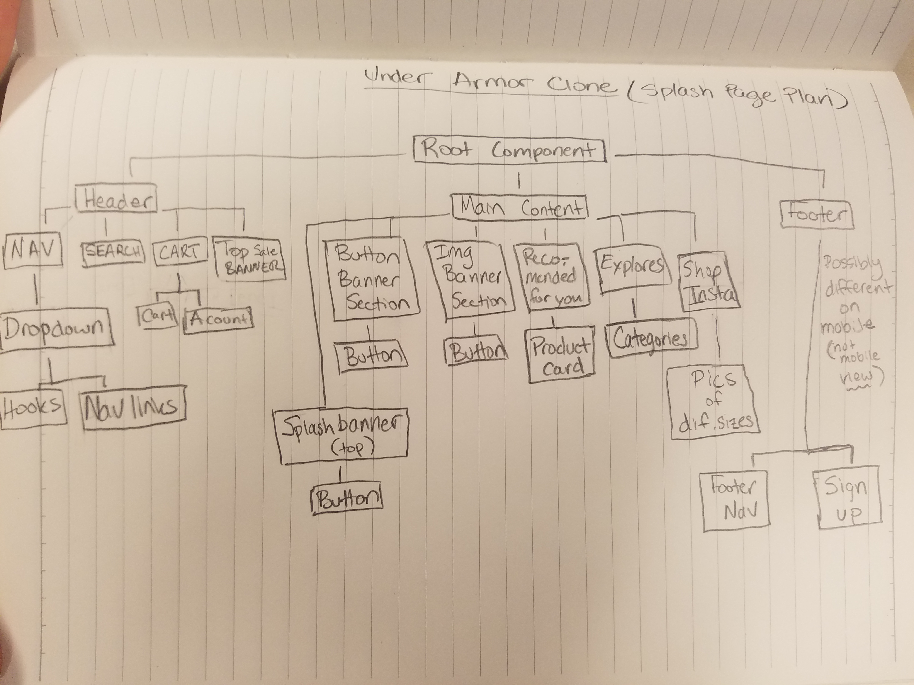

# UnderArmorClone

#### Angular project for Epicodus

_Published_ **March 29 2019**< br>
_Author_ **Kim McConnell**

1. [Description](#description)
1. [Learning Objective](#learning-objective)
1. [Product Requirements](#product-requirements)
1. [Planning](#planning)
1. [Development Specs](#development-specs)
1. [Stretch Goals](#stretch-goals)
1. [Installation](#installation)
1. [Known Bugs](#known-bugs)
1. [Technologies Used](#technologies-used)
1. [License](#license)

### Description
A clone of the Under Armor website using the Angular framework and sass for styling.

### Learning Objective
To practice using Angular and to get used to using components to plan and style a UI.

### Product Requirements
* The clone site must look and function the same way as the original site.
* Angular implemented with the MVC model (where C = component)
* Data is passed down to child components
* Actions are passed up to parent components

## Planning
Below is the core plan for the project. Each box represents a component. Components may be repeated multiple times, as necessary.

### Development Specs

Specification | Input | Output
------------- | ----- | ------

### Stretch Goals
* Add multi-page functionality
* Use a product API to get placeholder data for products

### Installation
* Clone from https://github.com/kimmcconnell/under-armor-clone.git either directly from GitHub or running `git clone https://github.com/kimmcconnell/under-armor-clone.git` in your terminal
* Run `$ npm install` in your terminal after navigating to the under-armor-clone directory
* If you do not have the angular CLI package already installed on your computer, run `npm install -g @angular/cli@1.6.5`
* Run `ng serve --open` to open the project in a browser window

### Known Bugs
* None identified

### Technologies Used
* Angular framework with Typescript
* Sass with variables and mixins

### License
[MIT](./LICENSE.txt)

Copyright (c) Kim McConnell

This project was generated with [Angular CLI](https://github.com/angular/angular-cli) version 1.6.5.

## Development server

Run `ng serve` for a dev server. Navigate to `http://localhost:4200/`. The app will automatically reload if you change any of the source files.

## Code scaffolding

Run `ng generate component component-name` to generate a new component. You can also use `ng generate directive|pipe|service|class|guard|interface|enum|module`.

## Build

Run `ng build` to build the project. The build artifacts will be stored in the `dist/` directory. Use the `-prod` flag for a production build.

## Running unit tests

Run `ng test` to execute the unit tests via [Karma](https://karma-runner.github.io).

## Running end-to-end tests

Run `ng e2e` to execute the end-to-end tests via [Protractor](http://www.protractortest.org/).

## Further help

To get more help on the Angular CLI use `ng help` or go check out the [Angular CLI README](https://github.com/angular/angular-cli/blob/master/README.md).
